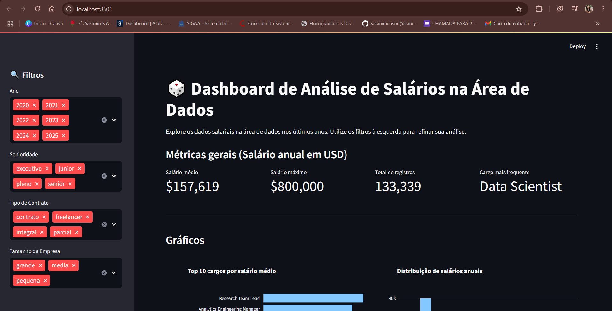
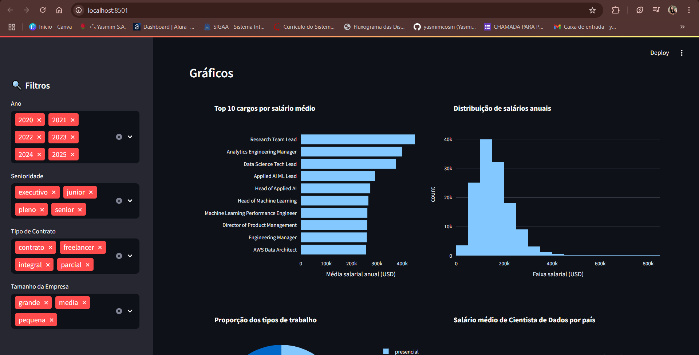
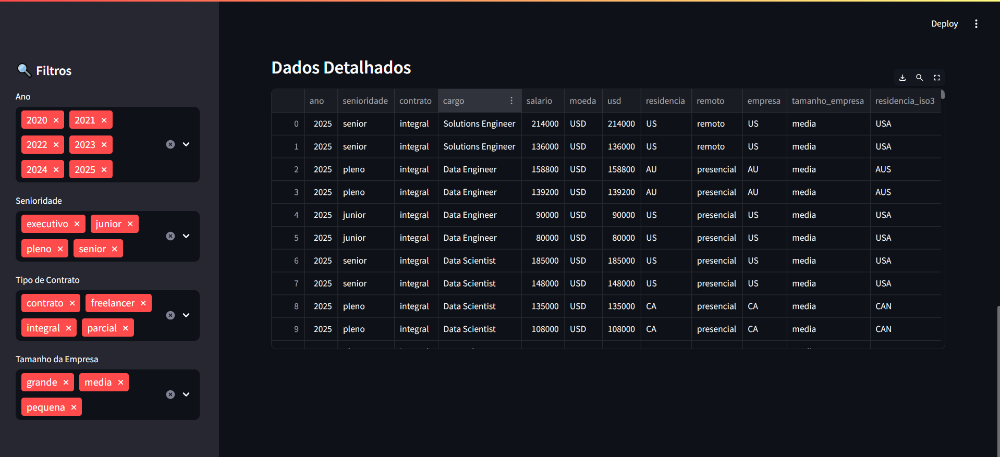

## 🧠 Projeto: Dashboard Interativo com Python

### 📊 Sobre o projeto

Este projeto foi desenvolvido durante uma **Imersão de 4 dias promovida pela [Alura](https://www.alura.com.br/)**, com foco em análise e visualização de dados utilizando Python.

O resultado final é um **dashboard interativo** criado com a biblioteca **Streamlit**, que permite a visualização dinâmica dos dados e facilita a análise de informações de forma intuitiva.

---

### 🛠️ Tecnologias e bibliotecas utilizadas

* [Python](https://www.python.org/)
* [Pandas](https://pandas.pydata.org/) – Manipulação de dados
* [Plotly](https://plotly.com/python/) – Gráficos interativos
* [Streamlit](https://streamlit.io/) – Criação do dashboard web

---

### 🚀 Funcionalidades do Dashboard

* Leitura e análise de dados com Pandas
* Visualização de gráficos interativos com Plotly
* Interface amigável e interativa com Streamlit
* Filtros dinâmicos para explorar os dados

---

### 🖼️ Exemplo do Dashboard

A seguir estão alguns prints do resultado final:


*Visão geral da página inicial com filtros e resumo de dados*

<br><br>


*Exemplo de gráfico interativo gerado com Plotly*

<br><br>


*Seção com análise detalhada de métricas e comparações*

<br><br>


*Última seção do dashboard com insights finais*

<br><br>

---

### 📁 Como rodar o projeto

1. Clone o repositório:

   ```bash
   git clone https://github.com/seu-usuario/seu-repositorio.git
   ```

2. Navegue até a pasta do projeto:

   ```bash
   cd nome-da-pasta
   ```

3. Instale as dependências:

   ```bash
   pip install -r requirements.txt
   ```

4. Rode o dashboard:

   ```bash
   streamlit run app.py
   ```

---

### 📚 Aprendizados

Durante essa imersão, pude:

* Praticar conceitos de **limpeza e tratamento de dados** com o Pandas;
* Aprender a construir **visualizações interativas** com o Plotly;
* Criar uma **aplicação web com poucos comandos** usando o Streamlit;
* Ter uma visão prática de como **dados podem ser transformados em insights visuais**.

---

### 🤝 Agradecimentos

Agradeço à equipe da **Alura** pela didática e proposta da imersão. Foi uma experiência muito enriquecedora que ampliou minha visão sobre o uso de dados com Python.

Se quiser, posso já te passar o **README.md pronto** com esses prints referenciados para você só fazer upload no seu projeto. Quer que eu gere o arquivo já formatado?
